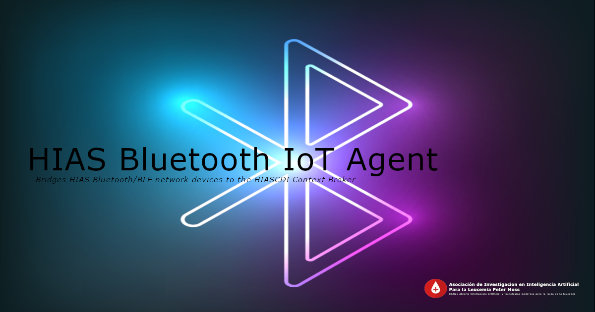

# Asociación de Investigacion en Inteligencia Artificial Para la Leucemia Peter Moss
## HIAS Bluetooth IoT Agent

      
 
 

&nbsp;

# Table Of Contents

- [Introduction](#introduction)
- [HIAS](#hias)
- [HIAS IoT Agents](#hias-iot-agents)
- [GETTING STARTED](#getting-started)
- [Contributing](#contributing)
  - [Contributors](#contributors)
- [Versioning](#versioning)
- [License](#license)
- [Bugs/Issues](#bugs-issues)

&nbsp;

# Introduction

The **HIAS Bluetooth IoT Agent** is a bridge between HIAS devices that support Bluetooth/Bluetooth Low Energy protocol and the HIASCDI Context Broker.

&nbsp;

# HIAS

[HIAS - Hospital Intelligent Automation Server](https://github.com/AIIAL/HIAS-Server) is an open-source automation server designed to control and manage an intelligent network of IoT connected devices and applications.

&nbsp;

# HIAS IoT Agents

The HIAS iotJumpWay Agents are a selection of protocol/transfer specific applications that act as a bridge between the HIAS Context Broker and the devices and applications connected to the HIAS network via the iotJumpWay. Supported protocols currently include HTTP, MQTT, Websockets, AMQP and Bluetooth/Bluetooth Low Energy (BLE).

Each IoT Agent provides a North & South Port interface that allows communication to and from the Context Broker.

__Source: [FIWARE IoT Agents](https://fiware-tutorials.readthedocs.io/en/latest/iot-agent/index.html)__

The North Port interface of an IoT Agent listens to southbound traffic coming from the Context Broker towards the devices and applications.

__Source: [FIWARE IoT Agents](https://fiware-tutorials.readthedocs.io/en/latest/iot-agent/index.html)__

The IoT Agent sends southbound traffic to devices and applications using a protocol that is supported by the device/application, and receives northbound traffic from the devices/applications which it then forwards to the Context Broker.

&nbsp;

# GETTING STARTED

To get started follow the [Getting Started](docs/getting-started.md) guide.

&nbsp;

# Contributing
Asociación de Investigacion en Inteligencia Artificial Para la Leucemia Peter Moss encourages and welcomes code contributions, bug fixes and enhancements from the Github community.

Please read the [CONTRIBUTING](CONTRIBUTING.md "CONTRIBUTING") document for a full guide to forking our repositories and submitting your pull requests. You will also find information about our code of conduct on this page.

## Contributors
- [Adam Milton-Barker](https://www.leukemiaairesearch.com/association/volunteers/adam-milton-barker "Adam Milton-Barker") - [Asociación de Investigacion en Inteligencia Artificial Para la Leucemia Peter Moss](https://www.leukemiaresearchassociation.ai "Asociación de Investigacion en Inteligencia Artificial Para la Leucemia Peter Moss") President/Founder & Lead Developer, Sabadell, Spain

&nbsp;

# Versioning
We use SemVer for versioning.

&nbsp;

# License
This project is licensed under the **MIT License** - see the [LICENSE](LICENSE "LICENSE") file for details.

&nbsp;

# Bugs/Issues
We use the [repo issues](issues "repo issues") to track bugs and general requests related to using this project. See [CONTRIBUTING](CONTRIBUTING.md "CONTRIBUTING") for more info on how to submit bugs, feature requests and proposals.