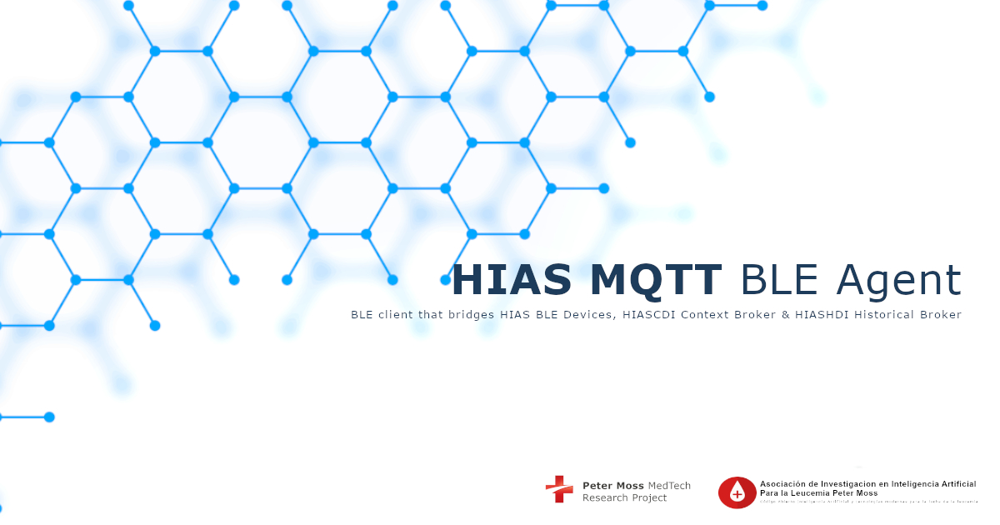

# Agent Documentation

     

# Introduction

A **HIAS BLE Agent** is a bridge between **HIAS BLE Device & Applications**, and the **HIASCDI Context Broker**. The **HIAS MQTT BLE Agent** is a HIAS IoT Agent that polls HIAS BLE devices and applications for data, then processes the data as an IoT Agent.

The HIAS MQTT BLE Agent has been designed to be run on a Raspberry Pi 3b or above.

&nbsp;

# MQTT

The Message Queuing Telemetry Transport (MQTT) is a lightweight machine to machine communication protocol designed to provide communication between low resource devices.

The protocol is publish-subscribe (Pub/Sub) communication protocol that runs over the Internet Protocol Suite (TCP/IP).

&nbsp;

# BLE

Bluetooth Low Energy (BLE/Bluetooth LE/Bluetooth Smart) is a low powered wireless communication protocol designed for short range data comunication between devices. BLE was designed to provide low energy consumption when transmitting data.

&nbsp;

# HIAS

[HIAS - Hospital Intelligent Automation Server](https://github.com/AIIAL/HIAS-Core) is an open-source automation server designed to control and manage an intelligent network of IoT connected devices and applications.

## HIAS IoT Agents

The HIAS iotJumpWay Agents are a selection of protocol/transfer specific applications that act as a bridge between the **HIASCDI Contextual Data Interface** & the **HIASHDI Historical Data Interface** and the devices and applications connected to the HIAS network via the iotJumpWay. Supported protocols currently include **HTTP**, **MQTT**, **Websockets**, **AMQP** and **Bluetooth/Bluetooth Low Energy (BLE)**.

Each IoT Agent provides a North & South Port interface that allows communication to and from the Context Broker.

__Source: [FIWARE IoT Agents](https://fiware-tutorials.readthedocs.io/en/latest/iot-agent/index.html)__

The North Port interface of an IoT Agent listens to southbound traffic coming from the Context Broker towards the devices and applications.

__Source: [FIWARE IoT Agents](https://fiware-tutorials.readthedocs.io/en/latest/iot-agent/index.html)__

The IoT Agent sends southbound traffic to devices and applications using a protocol that is supported by the device/application, and receives northbound traffic from the devices/applications which it then forwards to the Context Broker.

## HIAS BLE Agents

HIAS BLE Agents are a selection of protocol/transfer specific agents that coomunicate with BLE enabled devices to retrieve or send data. Retrieved data is processed in the same way as other IoT Agents.

&nbsp;

# GETTING STARTED

To get started, follow the following guides:

- [Raspberry Pi installation guide](installation/rpi.md)
- [Raspberry Pi usage guide](usage/rpi.md)

&nbsp;

# Contributing
Asociación de Investigacion en Inteligencia Artificial Para la Leucemia Peter Moss encourages and welcomes code contributions, bug fixes and enhancements from the Github community.

Please read the [CONTRIBUTING](https://github.com/AIIAL/HIAS-MQTT-BLE-Agent/blob/main/CONTRIBUTING.md "CONTRIBUTING") document for a full guide to forking our repositories and submitting your pull requests. You will also find our code of conduct in the [Code of Conduct](https://github.com/AIIAL/HIAS-MQTT-BLE-Agent/blob/main/CODE-OF-CONDUCT.md) document.

## Contributors
- [Adam Milton-Barker](https://www.leukemiaairesearch.com/association/volunteers/adam-milton-barker "Adam Milton-Barker") - [Asociación de Investigacion en Inteligencia Artificial Para la Leucemia Peter Moss](https://www.leukemiaresearchassociation.ai "Asociación de Investigacion en Inteligencia Artificial Para la Leucemia Peter Moss") President/Founder & Lead Developer, Sabadell, Spain

&nbsp;

# Versioning
We use SemVer for versioning.

&nbsp;

# License
This project is licensed under the **MIT License** - see the [LICENSE](https://github.com/AIIAL/HIAS-MQTT-BLE-Agent/blob/main/LICENSE "LICENSE") file for details.

&nbsp;

# Bugs/Issues
We use the [repo issues](https://github.com/AIIAL/HIAS-MQTT-BLE-Agent/issues "repo issues") to track bugs and general requests related to using this project. See [CONTRIBUTING](https://github.com/AIIAL/HIAS-MQTT-BLE-Agent/CONTRIBUTING.md "CONTRIBUTING") for more info on how to submit bugs, feature requests and proposals.